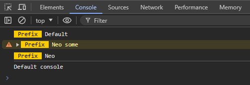

# Console X

A quick way to improve the browser console messages to include a prefix and different colours.

This demo contains all the necessary JavaScript and CSS to produce a working prototype.

Here's a screenshot:

